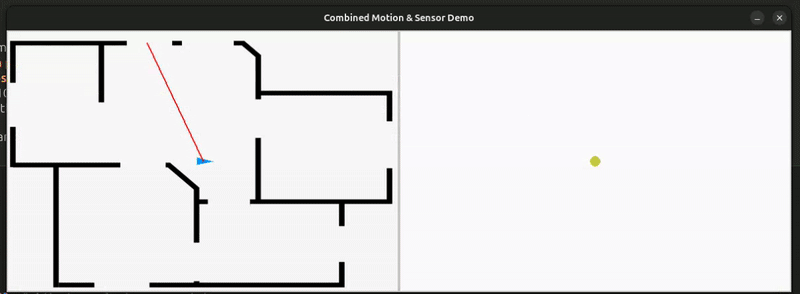

# 🗺️ A brief intro to SLAM with code

This repository contains interactive **Jupyter notebooks** that introduce the fundamentals of **Simultaneous Localization and Mapping (SLAM)**. The notebooks provide step-by-step implementations of **Bayes Filters, Kalman Filters, Particle Filters, and Graph-based methods**, combining theoretical explanations with Python code.  

The material is structured as a **three-lecture mini-course**. It only covers a small portion of the rich SLAM literature and is intended as a beginner-friendly introduction.



---

## 🚀 How to Run

You can run the notebooks in different environments depending on your preference.

### 🔹 Option 1: Visual Studio Code

1. Clone the repository:

   ```bash
   git clone https://github.com/nstathou/hello-slam.git
   cd hello-slam

2. (Recommended) Create and activate a virtual environment:

    ```bash
    python -m venv .hello_slam
    # Linux
    source .hello_slam/bin/activate
    # Windows (PowerShell)
    .hello_slam\Scripts\Activate.ps1

3. Install dependencies:

    ```bash
    pip install -r requirements.txt

4. Open the folder in Visual Studio Code.

    - Install the Python and Jupyter extensions.

    - Open any `.ipynb` file, select a Python kernel, and run cells.

### 🔹 Option 2: JupyterLab

1. Clone the repository (same as above).

2. (Optional) Create and activate a virtual environment (same as above).

3. Install dependencies (same as above).

4. Install Jupyter:
   ```bash
   pip install jupyter-core
   
5. Go into the folder and launch JupyterLab:

    ```bash
    cd hello-slam
    jupyter lab

6. Open any notebook `(.ipynb)` and run the cells.

### 🔹 Option 3: Google Colab (Optional)

1. Download this repository as a .zip file from GitHub and extract it locally.

2. Go to [Google Colab](https://colab.google/).

3. Upload the notebook `(.ipynb)` files you want to run.

4. If the notebook needs extra packages, install them at the top of the notebook, for example:

    ```bash
    !pip install numpy matplotlib scipy

---

## 📂 Repository Structure

The course is organized into modules:

### **0. Introduction**

- `0_intro.ipynb` – An overview of what is SLAM.

### **1. Kalman Filters**

- `1_bayes.ipynb` – Bayes filters and recursive state estimation.  
- `2_models.ipynb` – Motion and sensor models.  
- `3_kalman_filters.ipynb` – Kalman & Extended Kalman filters.  
- `4_ekf_slam.ipynb` – EKF-SLAM implementation.

### **2. Particle Filters**

- `1_grid_maps.ipynb` – Occupancy grid mapping.  
- `2_particle_filter.ipynb` – Monte Carlo localization.  
- `3_fast_slam.ipynb` – FastSLAM.  
- `4_grid_slam_rb_pf.ipynb` – Rao–Blackwellized particle filter for SLAM.

### **3. Least Squares / Graph-based SLAM**

- `1_least_squares.ipynb` – Nonlinear least-squares estimation.  
- `2_least_squares_slam.ipynb` – Least-squares formulation of SLAM.  
- `3_graph_slam.ipynb` – Graph-based SLAM.

---

## 🙏 Acknowledgments

This material is heavily inspired by the **[SLAM Course](https://www.youtube.com/playlist?list=PLgnQpQtFTOGQrZ4O5QzbIHgl3b1JHimN_)** by *Prof. Cyrill Stachniss* and the **[Probabilistic Robotics](https://mitpress.mit.edu/9780262201629/probabilistic-robotics/)** book by *Sebastian Thrun, Wolfram Burgard, and Dieter Fox*.  

For additional references and suggested literature, please check the `0_intro.ipynb` notebook.
